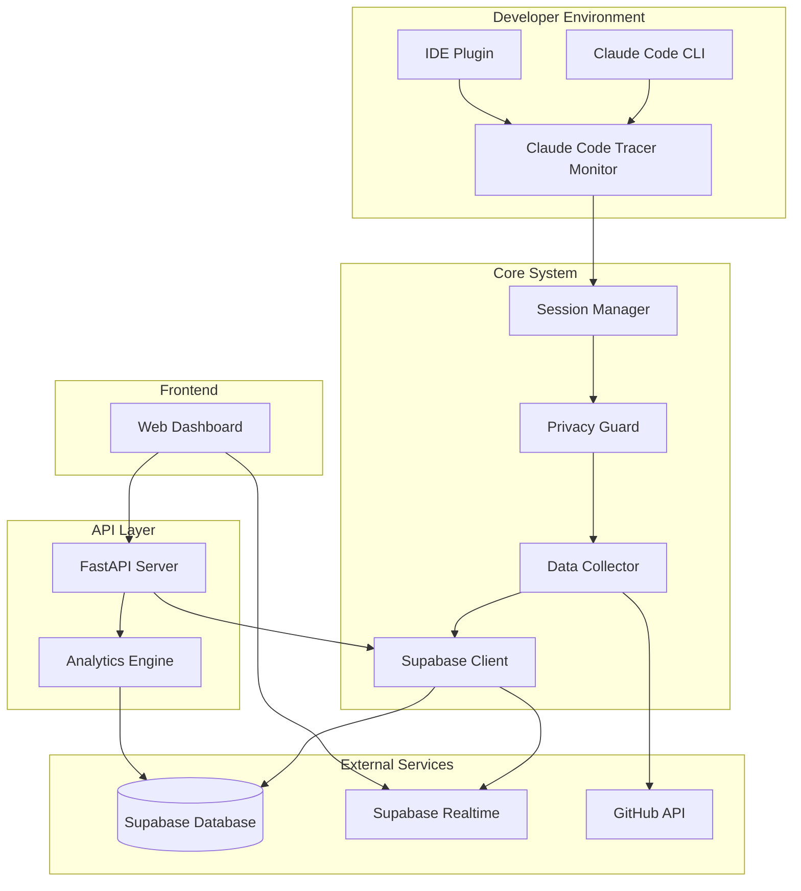

# Claude Code Tracer - システムアーキテクチャ

## 概要

Claude Code Tracer は、Claude Code とのインタラクションを自動的に追跡・記録し、開発効率の向上とナレッジ共有を支援するシステムです。

## システム構成図



## コンポーネント設計

### 1. Claude Code Monitor
Claude Code の実行を監視し、セッション情報をリアルタイムで収集するコアコンポーネント。

**責務:**
- Claude Code SDK を使用したセッション監視
- インタラクションデータの収集
- セッション状態の管理

**技術詳細:**
```python
class ClaudeCodeMonitor:
    def __init__(self, supabase_service: SupabaseService):
        self.supabase = supabase_service
        self.active_sessions: Dict[str, SessionInfo] = {}
    
    async def start_monitoring(self):
        """バックグラウンドでセッション監視を開始"""
        pass
```

### 2. Privacy Guard
機密情報を自動的に検出し、マスキングするセキュリティコンポーネント。

**責務:**
- パターンマッチングによる機密情報検出
- 段階的なセキュリティレベル管理
- カスタムルールのサポート

**検出対象:**
- API キー（OpenAI, Anthropic, GitHub 等）
- データベース接続文字列
- 個人情報（メールアドレス、電話番号）
- クレジットカード番号
- プライベート IP アドレス

### 3. Session Manager
Claude Code セッションのライフサイクルを管理。

**責務:**
- セッションの作成・更新・終了
- セッションメタデータの管理
- タイムアウト処理

### 4. Data Collector
収集したデータを構造化し、永続化する。

**責務:**
- データの正規化
- バッチ処理による効率的な保存
- エラーハンドリングとリトライ

### 5. Supabase Integration
Supabase との連携を管理するサービス層。

**機能:**
- CRUD 操作
- リアルタイム同期
- Row Level Security (RLS) の適用
- 接続プール管理

### 6. Analytics Engine
収集データから洞察を生成する分析エンジン。

**分析内容:**
- 使用パターンの識別
- 効率性メトリクスの計算
- トピッククラスタリング
- 時系列分析

## データフロー

### 1. セッション開始時
```
1. Claude Code 起動検知
2. 新規セッション作成
3. Supabase へセッション情報保存
4. リアルタイム監視開始
```

### 2. インタラクション記録
```
1. ユーザー入力/Claude 応答検知
2. Privacy Guard による機密情報チェック
3. データ正規化
4. Supabase へ保存
5. リアルタイム配信
```

### 3. セッション終了時
```
1. セッション終了検知
2. 統計情報の集計
3. セッション情報更新
4. 分析データ生成
```

## データモデル

### Sessions テーブル
```sql
CREATE TABLE claude_sessions (
    id UUID PRIMARY KEY,
    session_id VARCHAR UNIQUE NOT NULL,
    user_id UUID REFERENCES auth.users(id),
    project_path TEXT,
    start_time TIMESTAMPTZ NOT NULL,
    end_time TIMESTAMPTZ,
    total_interactions INTEGER DEFAULT 0,
    total_cost_usd DECIMAL(10,6) DEFAULT 0,
    status VARCHAR DEFAULT 'active',
    metadata JSONB,
    created_at TIMESTAMPTZ DEFAULT NOW()
);
```

### Interactions テーブル
```sql
CREATE TABLE claude_interactions (
    id UUID PRIMARY KEY,
    session_id UUID REFERENCES claude_sessions(id),
    message_type VARCHAR NOT NULL,
    user_prompt TEXT,
    claude_response TEXT,
    tools_used JSONB,
    performance_metrics JSONB,
    context_analysis JSONB,
    privacy_status JSONB,
    created_at TIMESTAMPTZ DEFAULT NOW()
);
```

## セキュリティ設計

### 1. 認証・認可
- Supabase Auth による認証
- Row Level Security (RLS) によるデータ分離
- JWT トークンベースの API 認証

### 2. データ暗号化
- TLS 1.3 による転送時暗号化
- PostgreSQL 標準暗号化による保存時暗号化
- 機密情報の自動マスキング

### 3. プライバシー保護
- 多層的な機密情報検出
- ユーザー定義のプライバシールール
- GDPR 準拠のデータ管理

## パフォーマンス最適化

### 1. 非同期処理
- asyncio による並行処理
- バックグラウンドタスクの活用
- ノンブロッキング I/O

### 2. キャッシング戦略
- Redis によるセッション情報キャッシュ
- 分析結果のキャッシング
- API レスポンスキャッシュ

### 3. データベース最適化
- インデックスの適切な設定
- パーティショニングによる大規模データ対応
- 接続プーリング

## スケーラビリティ

### 1. 水平スケーリング
- ステートレスな API 設計
- ロードバランサー対応
- マイクロサービス化の準備

### 2. 垂直スケーリング
- リソース使用量の監視
- 自動スケーリング設定
- パフォーマンスボトルネックの特定

## 監視・運用

### 1. メトリクス収集
- Prometheus によるメトリクス収集
- Grafana ダッシュボード
- カスタムメトリクスの定義

### 2. ロギング
- 構造化ログの採用
- Loki による集中ログ管理
- エラートラッキング

### 3. アラート
- 異常検知アラート
- パフォーマンス劣化通知
- セキュリティインシデント通知

## 障害対策

### 1. 冗長性
- Supabase の高可用性活用
- ローカルフォールバック機能
- データバックアップ

### 2. 障害復旧
- 自動リトライ機構
- サーキットブレーカーパターン
- グレースフルシャットダウン

### 3. データ整合性
- トランザクション管理
- イベントソーシング
- 監査ログ

## 今後の拡張計画

### Phase 1 (現在)
- 基本的なセッション追跡
- プライバシー保護
- Web ダッシュボード

### Phase 2
- AI による自動分析
- チーム機能
- カスタムレポート

### Phase 3
- プラグインエコシステム
- エンタープライズ機能
- マルチテナント対応